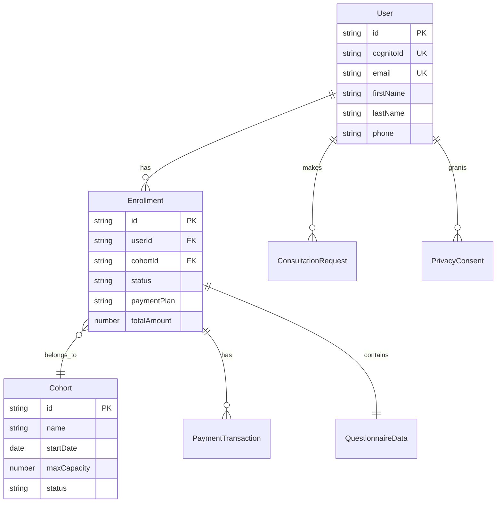

# Data Model: DPNR Course Landing Page

**Date**: 2025-09-21 | **Feature**: DPNR Course Landing Page

## Entity Definitions

### 1. User
Represents authenticated users who can access the member portal.

```typescript
interface User {
  id: string;                    // UUID, primary key
  cognitoId: string;             // AWS Cognito user ID
  email: string;                 // Unique, required
  firstName: string;             // Required
  lastName: string;              // Required
  phone: string;                 // Israeli format validation
  preferredLanguage: 'he' | 'en'; // Default: 'he'
  role: 'student' | 'admin' | 'instructor'; // Default: 'student'
  createdAt: Date;
  updatedAt: Date;
  deletedAt?: Date;              // Soft delete for GDPR
}
```

**Validation Rules**:
- Email: Valid email format, unique constraint
- Phone: Israeli phone format (05x-xxxxxxx or +9725x-xxxxxxx)
- Names: 2-50 characters, Unicode support for Hebrew

### 2. Enrollment
Represents a user's enrollment in a course cohort.

```typescript
interface Enrollment {
  id: string;                    // UUID, primary key
  userId: string;                // Foreign key to User
  cohortId: string;              // Foreign key to Cohort
  status: EnrollmentStatus;      // See enum below
  paymentPlan: PaymentPlan;      // See enum below
  totalAmount: number;           // In ILS
  paidAmount: number;            // Amount paid so far
  enrollmentDate: Date;
  questionnaire: QuestionnaireData; // JSON field
  createdAt: Date;
  updatedAt: Date;
}

enum EnrollmentStatus {
  PENDING_PAYMENT = 'pending_payment',
  ACTIVE = 'active',
  COMPLETED = 'completed',
  CANCELLED = 'cancelled',
  REFUNDED = 'refunded'
}

enum PaymentPlan {
  FULL = 'full',           // ₪6,400
  FIVE_INSTALLMENTS = '5', // ₪1,360 x 5
  TWELVE_INSTALLMENTS = '12' // ₪580 x 12
}
```

**Validation Rules**:
- One active enrollment per user per cohort
- Payment validation before status change to ACTIVE
- Refund only within policy period (configurable)

### 3. Cohort
Represents a course cohort with specific dates and capacity.

```typescript
interface Cohort {
  id: string;                    // UUID, primary key
  name: string;                  // e.g., "December 2025 Cohort"
  startDate: Date;               // Course start date
  endDate: Date;                 // Course end date
  maxCapacity: number;           // Default: 20
  currentEnrollment: number;     // Computed from active enrollments
  status: CohortStatus;
  location: string;              // Default: "Mazkeret Batya"
  schedule: string;              // e.g., "Weekly evenings, 1.5-2 hours"
  createdAt: Date;
  updatedAt: Date;
}

enum CohortStatus {
  UPCOMING = 'upcoming',
  OPEN_ENROLLMENT = 'open_enrollment',
  FULL = 'full',
  IN_PROGRESS = 'in_progress',
  COMPLETED = 'completed'
}
```

**Validation Rules**:
- Cannot exceed maxCapacity
- Auto-update status when full
- Start date must be future date when creating

### 4. ConsultationRequest
Represents a request for enrollment consultation.

```typescript
interface ConsultationRequest {
  id: string;                    // UUID, primary key
  firstName: string;
  lastName: string;
  email: string;
  phone: string;
  preferredLanguage: 'he' | 'en';
  preferredTimeSlot: string;     // Free text
  message?: string;              // Optional additional info
  status: RequestStatus;
  userId?: string;               // Optional link to User if authenticated
  createdAt: Date;
  processedAt?: Date;
}

enum RequestStatus {
  NEW = 'new',
  CONTACTED = 'contacted',
  SCHEDULED = 'scheduled',
  COMPLETED = 'completed',
  CANCELLED = 'cancelled'
}
```

**Validation Rules**:
- Email and phone required
- Duplicate detection by email/phone
- Auto-email confirmation on submission

### 5. PaymentTransaction
Represents payment transactions via Tranzila.

```typescript
interface PaymentTransaction {
  id: string;                    // UUID, primary key
  enrollmentId: string;          // Foreign key to Enrollment
  tranzillaReference: string;    // Tranzila transaction ID
  amount: number;                // Amount in ILS
  installmentNumber?: number;    // For installment plans
  status: TransactionStatus;
  paymentMethod: string;         // Masked card number
  failureReason?: string;
  processedAt: Date;
  createdAt: Date;
}

enum TransactionStatus {
  PENDING = 'pending',
  SUCCESS = 'success',
  FAILED = 'failed',
  REFUNDED = 'refunded'
}
```

**Validation Rules**:
- Amount must match enrollment plan
- Unique Tranzila reference
- Installment tracking for payment plans

### 6. QuestionnaireData
Embedded JSON structure for enrollment questionnaire.

```typescript
interface QuestionnaireData {
  motivation: string;            // Why join DPNR? (required)
  previousExperience: boolean;   // Previous personal development?
  expectations: string;          // What do you hope to achieve?
  referralSource?: string;       // How did you hear about us?
  specialNeeds?: string;         // Any accommodations needed?
  agreedToTerms: boolean;        // Terms acceptance (required)
  agreedToPrivacy: boolean;      // Privacy policy (required)
  marketingConsent: boolean;     // Email marketing opt-in
  submittedAt: Date;
}
```

### 7. PrivacyConsent
GDPR compliance tracking for user consent.

```typescript
interface PrivacyConsent {
  id: string;                    // UUID, primary key
  userId: string;                // Foreign key to User
  consentType: ConsentType;
  granted: boolean;
  ipAddress: string;
  userAgent: string;
  version: string;               // Policy version
  createdAt: Date;
  revokedAt?: Date;
}

enum ConsentType {
  PRIVACY_POLICY = 'privacy_policy',
  TERMS_OF_SERVICE = 'terms_of_service',
  MARKETING_EMAILS = 'marketing_emails',
  ANALYTICS_COOKIES = 'analytics_cookies'
}
```

## Relationships



## State Transitions

### Enrollment Status Flow
```
PENDING_PAYMENT -> ACTIVE (on successful payment)
ACTIVE -> COMPLETED (on course completion)
ACTIVE -> CANCELLED (on user request)
CANCELLED -> REFUNDED (within refund period)
```

### Cohort Status Flow
```
UPCOMING -> OPEN_ENROLLMENT (30 days before start)
OPEN_ENROLLMENT -> FULL (when capacity reached)
OPEN_ENROLLMENT -> IN_PROGRESS (on start date)
FULL -> IN_PROGRESS (on start date)
IN_PROGRESS -> COMPLETED (on end date)
```

### Consultation Request Flow
```
NEW -> CONTACTED (admin reaches out)
CONTACTED -> SCHEDULED (meeting arranged)
SCHEDULED -> COMPLETED (after consultation)
Any -> CANCELLED (if cancelled)
```

## Data Retention & GDPR

### Retention Periods
- **User Data**: Until deletion requested
- **Enrollment Data**: 7 years (tax requirements)
- **Payment Data**: 7 years (financial regulations)
- **Consultation Requests**: 1 year if not converted
- **Privacy Consent**: Permanent audit trail

### GDPR Operations
1. **Data Export**: All user-related data in JSON format
2. **Data Deletion**: Soft delete with 30-day recovery period
3. **Anonymization**: After deletion period, anonymize for analytics
4. **Consent Tracking**: Version-controlled consent records

## Indexes

### Performance Indexes
```sql
-- User lookups
CREATE INDEX idx_user_email ON users(email);
CREATE INDEX idx_user_cognito ON users(cognito_id);

-- Enrollment queries
CREATE INDEX idx_enrollment_user ON enrollments(user_id);
CREATE INDEX idx_enrollment_cohort ON enrollments(cohort_id);
CREATE INDEX idx_enrollment_status ON enrollments(status);

-- Consultation tracking
CREATE INDEX idx_consultation_status ON consultation_requests(status);
CREATE INDEX idx_consultation_created ON consultation_requests(created_at);

-- Payment lookups
CREATE INDEX idx_payment_enrollment ON payment_transactions(enrollment_id);
CREATE INDEX idx_payment_tranzila ON payment_transactions(tranzilla_reference);
```

## Migration Strategy

### Initial Schema Creation
1. Create all tables with constraints
2. Set up foreign key relationships
3. Add indexes for performance
4. Seed initial cohort data

### Future Considerations
- Course content management tables (Phase 2)
- Video progress tracking (Phase 2)
- Certificate generation records (Phase 2)
- Discussion forum data (Phase 3)

## Production Integration Enhancements (2025-09-22)

### AWS Cognito Integration Model

#### Enhanced User Model with Cognito
```typescript
interface User {
  id: string;                    // UUID, primary key
  cognitoId: string;             // AWS Cognito Sub UUID - REQUIRED
  email: string;                 // Synced from Cognito
  firstName: string;             // From Cognito custom attributes
  lastName: string;              // From Cognito custom attributes
  phone: string;                 // From Cognito phone_number
  preferredLanguage: 'he' | 'en'; // Custom attribute in Cognito
  role: 'student' | 'admin' | 'instructor'; // Custom attribute
  emailVerified: boolean;        // From Cognito email_verified
  phoneVerified: boolean;        // From Cognito phone_number_verified
  mfaEnabled: boolean;           // From Cognito MFA status
  lastLoginAt?: Date;            // Updated on JWT verification
  createdAt: Date;
  updatedAt: Date;
  deletedAt?: Date;              // Soft delete for GDPR
}
```

#### Cognito User Pool Configuration
```typescript
interface CognitoUserPool {
  userPoolId: string;            // AWS User Pool ID
  clientId: string;              // App Client ID
  region: string;                // AWS Region (e.g., 'us-east-1')
  domain: string;                // Hosted UI domain
  redirectUri: string;           // OAuth redirect URI
  logoutUri: string;             // Post-logout redirect URI

  // Custom attributes for DPNR
  customAttributes: {
    'custom:preferred_language': 'he' | 'en';
    'custom:role': 'student' | 'admin' | 'instructor';
    'custom:marketing_consent': boolean;
    'custom:terms_accepted_version': string;
  };
}
```

#### JWT Token Validation Model
```typescript
interface JWTClaims {
  sub: string;                   // Cognito User ID (cognitoId)
  email: string;                 // Verified email
  email_verified: boolean;       // Email verification status
  phone_number?: string;         // Phone number
  phone_number_verified?: boolean; // Phone verification
  'custom:preferred_language'?: string;
  'custom:role'?: string;
  'custom:marketing_consent'?: string;
  aud: string;                   // App Client ID
  iss: string;                   // Cognito issuer URL
  token_use: 'access' | 'id';    // Token type
  exp: number;                   // Expiration timestamp
  iat: number;                   // Issued at timestamp
}
```

### Database Connection Model

#### Supabase Connection Configuration
```typescript
interface DatabaseConfig {
  host: string;                  // Supabase database host
  port: number;                  // Default: 5432
  database: string;              // Database name
  username: string;              // Database user
  password: string;              // Database password
  ssl: boolean;                  // Always true for production
  connectionPooling: {
    max: number;                 // Max connections (default: 20)
    min: number;                 // Min connections (default: 2)
    acquireTimeoutMillis: number; // Connection timeout
    idleTimeoutMillis: number;   // Idle timeout
  };
  schema: string;                // Default: 'public'
}
```

#### Environment Variable Mapping
```typescript
interface EnvironmentConfig {
  // Database
  DATABASE_URL: string;          // Full Supabase connection string
  DATABASE_POOL_URL?: string;    // Connection pooling URL

  // AWS Cognito
  AWS_REGION: string;            // AWS region
  COGNITO_USER_POOL_ID: string;  // User Pool ID
  COGNITO_CLIENT_ID: string;     // App Client ID
  COGNITO_DOMAIN: string;        // Hosted UI domain

  // Application
  NEXTAUTH_URL: string;          // Frontend URL for redirects
  NEXTAUTH_SECRET: string;       // JWT signing secret

  // Optional
  COGNITO_CLIENT_SECRET?: string; // If app client has secret
  JWT_VERIFY_ISSUER?: string;    // Custom JWT issuer verification
}
```

### Authentication Flow Data Model

#### Session Management
```typescript
interface UserSession {
  userId: string;                // Internal user ID
  cognitoId: string;             // Cognito sub
  accessToken: string;           // Cognito access token
  idToken: string;               // Cognito ID token
  refreshToken: string;          // Cognito refresh token
  tokenType: 'Bearer';           // Token type
  expiresAt: Date;               // Access token expiration
  refreshExpiresAt: Date;        // Refresh token expiration
  scope: string[];               // Token scopes
  createdAt: Date;
  lastAccessedAt: Date;
}
```

#### Authentication State
```typescript
interface AuthenticationState {
  isAuthenticated: boolean;
  isLoading: boolean;
  user?: User;
  session?: UserSession;
  error?: AuthError;

  // Language preference from session
  preferredLanguage: 'he' | 'en';

  // Redirect handling
  redirectUrl?: string;
  returnTo?: string;
}

interface AuthError {
  code: string;                  // Error code from Cognito
  message: string;               // User-friendly message
  details?: any;                 // Technical details
  timestamp: Date;
}
```

### Production Data Validation Rules

#### Enhanced User Validation
```typescript
const UserValidation = {
  cognitoId: {
    required: true,
    pattern: /^[0-9a-f]{8}-[0-9a-f]{4}-[0-9a-f]{4}-[0-9a-f]{4}-[0-9a-f]{12}$/,
    unique: true
  },
  email: {
    required: true,
    format: 'email',
    unique: true,
    maxLength: 254
  },
  phone: {
    required: true,
    pattern: /^(\+972|0)(5[0-9])[0-9]{7}$/, // Israeli mobile format
    unique: true
  },
  preferredLanguage: {
    required: true,
    enum: ['he', 'en'],
    default: 'he'
  }
};
```

#### Database Constraints
```sql
-- Enhanced user table with Cognito integration
ALTER TABLE users
ADD CONSTRAINT uk_users_cognito_id UNIQUE (cognito_id),
ADD CONSTRAINT ck_users_email_format
  CHECK (email ~* '^[A-Za-z0-9._%+-]+@[A-Za-z0-9.-]+\.[A-Za-z]{2,}$'),
ADD CONSTRAINT ck_users_phone_israeli
  CHECK (phone ~* '^(\+972|0)(5[0-9])[0-9]{7}$'),
ADD CONSTRAINT ck_users_language
  CHECK (preferred_language IN ('he', 'en'));

-- Add indexes for production performance
CREATE INDEX CONCURRENTLY idx_users_cognito_id ON users(cognito_id);
CREATE INDEX CONCURRENTLY idx_users_email_verified ON users(email_verified) WHERE email_verified = true;
CREATE INDEX CONCURRENTLY idx_users_last_login ON users(last_login_at DESC);
```

### Production Monitoring Data

#### Authentication Metrics
```typescript
interface AuthMetrics {
  id: string;
  event: 'login' | 'logout' | 'registration' | 'password_reset';
  userId?: string;
  cognitoId?: string;
  ipAddress: string;
  userAgent: string;
  language: 'he' | 'en';
  success: boolean;
  errorCode?: string;
  duration?: number;            // Request duration in ms
  timestamp: Date;
}
```

#### Database Health Monitoring
```typescript
interface DatabaseMetrics {
  id: string;
  metric: 'connection_count' | 'query_duration' | 'error_rate';
  value: number;
  threshold?: number;
  status: 'normal' | 'warning' | 'critical';
  timestamp: Date;
}
```

This enhanced data model ensures seamless integration with AWS Cognito authentication and production-grade database connectivity while maintaining GDPR compliance and supporting the bilingual Hebrew/English user experience.