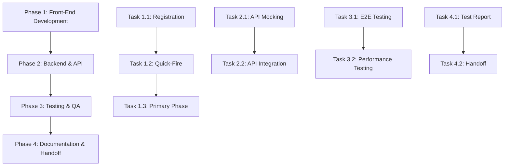

# Master Task Tracking

## Project Overview
This document provides a high-level overview of all project tasks and their dependencies. For detailed task breakdowns, refer to the individual phase documents.

## Phase Dependencies

## Phase Completion Criteria

### Phase 1: Front-End Development
- [ ] Registration screen implemented and tested
- [ ] Quick-Fire phase components complete
- [ ] Primary & Confirmation phases implemented
- [ ] All UI components responsive and accessible
- [ ] Unit test coverage ≥ 80%

### Phase 2: Backend & API
- [ ] Mock API endpoints implemented
- [ ] Frontend-backend integration complete
- [ ] Data validation in place
- [ ] Error handling implemented
- [ ] API documentation complete

### Phase 3: Testing & QA
- [ ] E2E test suite complete
- [ ] Performance metrics within target
- [ ] Accessibility compliance achieved
- [ ] All critical bugs resolved
- [ ] Test documentation complete

### Phase 4: Documentation & Handoff
- [ ] Comprehensive test report generated
- [ ] Technical documentation complete
- [ ] User documentation ready
- [ ] Training materials prepared
- [ ] Handoff meetings scheduled

## Risk Management

### Technical Risks
- [ ] Performance bottlenecks
- [ ] Integration challenges
- [ ] Browser compatibility issues
- [ ] Security vulnerabilities

### Project Risks
- [ ] Timeline delays
- [ ] Resource constraints
- [ ] Scope creep
- [ ] Knowledge transfer gaps

## Quality Gates

### Code Quality
- [ ] ESLint compliance
- [ ] TypeScript/PropTypes validation
- [ ] Code review completion
- [ ] Test coverage requirements

### Performance
- [ ] Page load time < 2s
- [ ] API response time < 200ms
- [ ] Lighthouse score > 90
- [ ] Memory usage within limits

### Security
- [ ] OWASP compliance
- [ ] Data encryption
- [ ] Authentication/Authorization
- [ ] Input validation

## Progress Tracking

### Weekly Checkpoints
- [ ] Task completion status
- [ ] Bug resolution rate
- [ ] Test coverage metrics
- [ ] Performance benchmarks

### Milestone Reviews
- [ ] Phase 1 completion
- [ ] Phase 2 completion
- [ ] Phase 3 completion
- [ ] Phase 4 completion

## Resource Allocation

### Development Team
- Frontend Developers: 2
- Backend Developers: 2
- QA Engineers: 1
- Technical Writer: 1

### Tools & Infrastructure
- [ ] Development environment
- [ ] Testing environment
- [ ] Staging environment
- [ ] CI/CD pipeline 